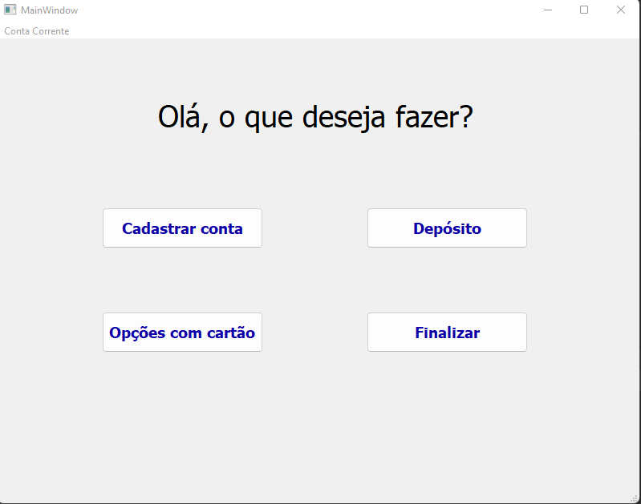

# caixa_eletronico
 
Bem-vindos ao meu projeto de Caixa Eletrônico moderno. O arquivo Principal.py traz a conexão com várias janelas e com o banco de dados Projeto.sql

Resumo: O programa oferece as opções de cadastrar conta e depósito na primeira janela, oferece a opção de entrar na conta também, e quando entra na conta há as opções de saque, transferência, ver saldo, extrato e opções pix. Nas opções pix temos as opções de cadastrar chave pix, ver as chaves já cadastradas e transferência com pix. Na opção de cadastrar chave pix também pode escolher entre celular, cpf, ou email. Tudo isso armazenando as contas e transações.

Projeto explicado passo a passo:

Na tela inicial temos as opções:

- Cadastrar Conta: Quando clicamos nesse botão, aparece outra janela pedindo para inserir Nome do titular, Agencia, Conta e Senha, a última no caso está escondida através de bolinhas. Nome do Titular deverá ter mais de 2 letras, Agencia mais de 2 caracteres, Conta mais de 5 Caracteres e Senha exatamente 6 caracteres. Caso um desses critérios não seja obedecido, aparece uma mensagem de erro e apaga os dados já digitados, para colocar de novo. Caso tente com uma conta já cadastrada no sistema, também haverá um erro. Caso esteja tudo dentro dos critérios, a conta é cadastrada no banco de dados do Caixa Eletrônico.

- Depósito: Quando clicamos nesse botão, aparece outra janela pedindo para inserir os dados da conta beneficiada, agencia e conta, e o valor que você quer depositar na conta, com os mesmos criterios do cadastrar, porém agora se colocar uma conta que não existe vai abrir mensagem de erro, e um valor igual ou menor a 0 também se configura como depósito inválido. Caso tudo esteja correto, o depósito será feito na respectiva conta com esses dados.

- Finalizar: Somente fecha o programa mesmo.

- Opções com cartão: Quando clicamos nesse botão, aparece outra janela pedindo para inserir os dados da conta que quer entrar, conta, agencia, senha, a última vai aparecer escondida através de bolinhas. Caso esteja com algum dado errado, vai ter uma mensagem de erro e limpar os campos para preencher de novo. Caso esteja tudo certo, vai entrar na conta e abrir outra janela de opções:
    - Saque: Quando clicamos nesse botão, aparece outra janela pedindo para clicar nas opções pre-definidas de saque, ou a última com um botão de 'outro valor' que abrirá uma janela para selecionar o quanto quer sacar. Aparece uma mensagem de contagem de notas, uns segundos depois aparece que o saque foi realizado com sucesso.
    - Transferência: Quando clicamos nesse botão, aparece uma janela pedindo as informações, conta, agencia e valor que quer transferir, caso esteja tudo certo, o valor transferido é retirado da sua conta transferindo para a outra.
    - Ver Saldo: Quando clicamos aqui aparece o saldo atual da conta.
    - Extrato: Quando clicamos aqui aparece uma tabela com as movimentações realizadas na conta, como saques, depósitos e transferências, e do lado aparece data e hora da movimentação.
    - Pix: Quando clicamos nesse botão vai aparecer outra janela com outras opções de botões:
        - Cadastrar chave pix: Aparece botões para escolher de que tipo é a chave pix:
            - CPF
            - Celular
            - Email
            Clica em um dos botões, coloca a chave pix, se não estiver cadastrada, vai ocorrer tudo certo, se estiver alguma já cadastrada do mesmo tipo, vai substituir.
        - Ver minhas chaves pix: Aparece uma tabela com CPF, Celular e Email, caso tenha alguma dessas chaves cadastrada, aparecerá em sua respectiva coluna.
        - Transferir com pix: Quando clicamos nesse botão, aparece uma janela pedindo para colocar a chave pix e o valor que quer transferir, caso não há a chave pix cadastrada no sistema, dará uma mensagem de erro. Caso exista e o valor seja positivo, e menor que o saldo atual, a transferência ocorrerá com uma mensagem de confirmação.
        - Voltar: Volta a tela anterior, de entrada de cartão.
    - Sair: Sai da conta para voltar a tela inicial.